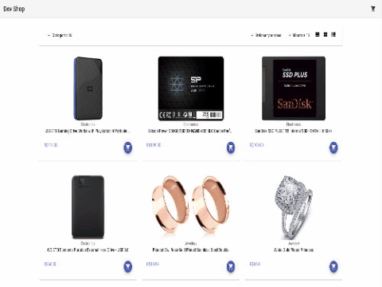

<div align="center" id="top"> 
  

  &#xa0;
</div>

<h1 align="center">Devshop</h1>

<p align="center">
  
  
  
  <!--  -->

  <!--  -->

  <!--  -->
</p>

<p align="center">
  <a href="#dart-about">Sobre</a> &#xa0; | &#xa0; 
  <a href="#rocket-technologies">Tecnologias</a> &#xa0; | &#xa0;
  <a href="#white_check_mark-requirements">Requerimentos</a> &#xa0; | &#xa0;
  <a href="#checkered_flag-starting">Iniciando</a> &#xa0;
</p>

<br>

## :dart: Sobre ##

Este projeto construído em Angular, simula um e-commerce que utiliza as principais features do framework. 
A loja virtual contém a listagem dos produtos por categorias, ordenação dos items por ordem alfábetica, três modos de exibição dos produtos, carrinho de compras e telas de pagamento.
Para trazer realidade ao projeto, utilizamos a [fakestoreapi.com/](fakestoreapi.com/), no qual consumimos os seguintes endpoints:
```bash
#GET produtos
/products

#GET categorias
/categories
```
O projeto utiliza como meio de pagamento, a API do [Stripe](https://stripe.com/docs), que recebe e registra os produtos existentes no carrinho de compras, no ato do processamento do pagamento. Após redireciona o usuário.

No diretório [angular](/angular/) você encontra o projeto front-end, já no diretório [server](/server/) você encontra o projeto back-end que integra o meio de pagamento ao projeto front-end, por meio do endpoint: `/checkout/`.

Você pode conferir um preview do projeto em [aqui](https://manustore.vercel.app/), mas para checar todas as funcionalidades indico o passo-a-passo contido em [Iniciando](#checkered_flag-starting).

## :rocket: Tecnologias ##

Este projeto utiliza as seguintes tecnologias:

- [TypeScript](https://www.typescriptlang.org/)
- [JavaScript](https://developer.mozilla.org/pt-BR/docs/Web/JavaScript)
- [Angular](https://angular.io)
- [Angular Material](https://material.angular.io/)
- [Tailwind](https://tailwindcss.com)
- [Express](https://expressjs.com/pt-br/)
- [Stripe](https://stripe.com/docs)

## :white_check_mark: Requerimentos ##

Antes de iniciar :checkered_flag:, você precisa ter o [Git](https://git-scm.com) e [Node](https://nodejs.org/en/) versão LTS instalados no seu ambiente de desenvolvimento. Recomendo também a instalação da ferramenta _[Angular CLI](https://angular.io/cli)_, que incremetará sua produtividade.
Você precisrá gerar as keys de autenticação conforme documentação do [Stripe](https://stripe.com/docs/test-mode), quais deverão ser inseridas no arquivo `/angular/src/environments/environment.ts`.
## :checkered_flag: Iniciando ##

```bash
# Clone este projeto
$ git clone https://github.com/ManuCoutinho/dev-shop.git

# Accesse para o projeto front
$ cd devshop/angular


# Accesse a API
$ cd devshop/server

# Instale as dependências em ambos os projetos
$ npm install

# Inicie o servidor com
$ npm run start

# Inicie o front-end com
$ ng serve ou npm run start

# A API irá rodar em <http://localhost:4242> e o front-end em <http://localhost:4200>
```

<a href="#top">Back to top</a>
